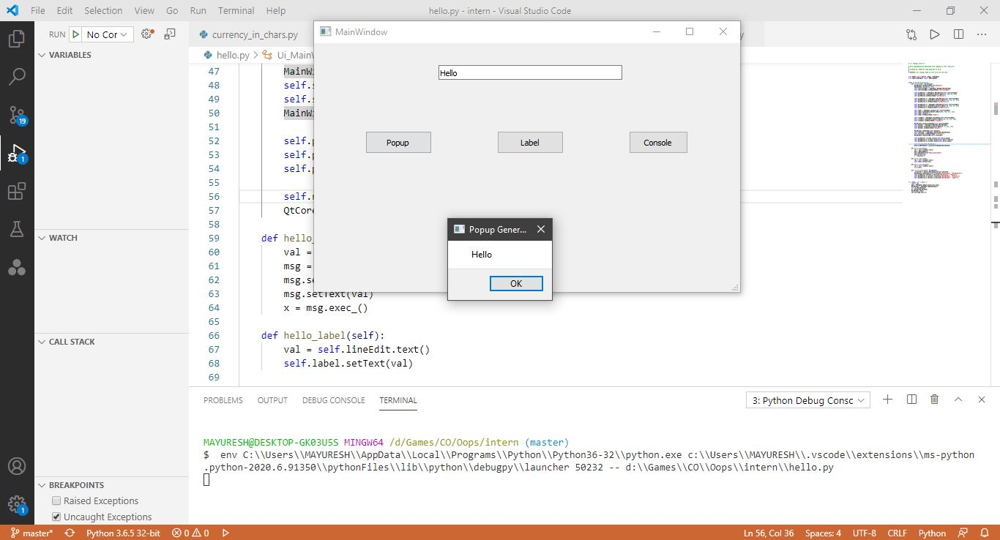
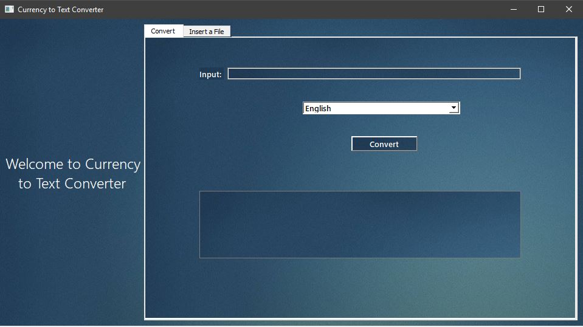
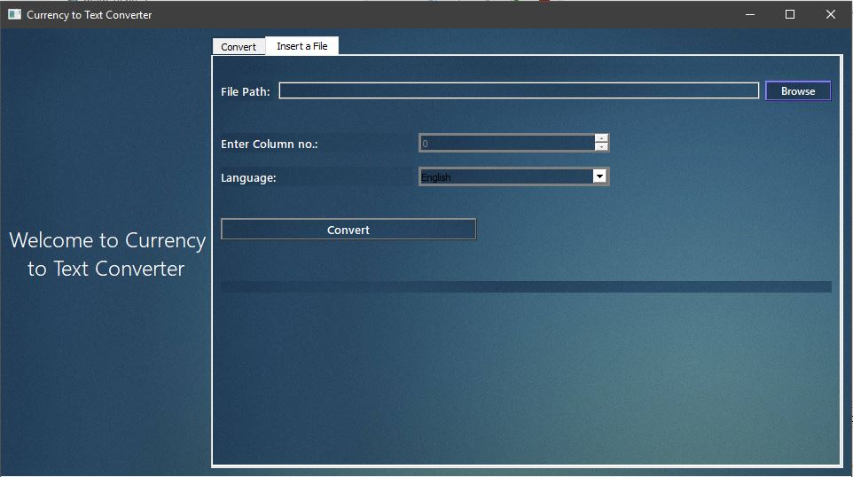

<!-- 
git init
-> command for initializing repository on local git server

git add
-> this command used for add specific files on git

git push
-> pushing the files from local server to centralized git server

git commit
-> to add commit to save the particular changes in file

git status 
-> to check the file status whether thy are staged, edited, delted etc. -->

<!-- 
# Hello World 
## Desktop Application
_Italic_
**Strong Bold**
~~10000~~

[Visit Website](www.google.com "Google")

Images


Use `for` loop

```
def console_output():
    print("Hello")

```
 -->


<!-- # Hello World 
## Desktop Application

_Description_
    This application is the example of the User Interface developed using Python Interface Framework known as PyQt5.
It is just a simple text printing application consist of single _LineEdit_ and three different buttons for three different kinds of output.
    **Popup**
    Popup button generates a popup for a string entered in LineEdit.
    **Label**
    Label button assigns a label with the string in LineEdit.
    **Console**
    Nothing but simply prints LineEdit input in Console.

The input in LineEdit can be anything as it doesn't have any restrictions.

Images


##How it Works:

1. Enter any string Input in LineEdit
2. Press the button from your choice.


##Code for creating LineEdit and pushButtons in PyQt5

**pushButton**
```
self.pushButton.clicked.connect(self.hello_popup)
self.pushButton_2.clicked.connect(self.hello_console)
self.pushButton_3.clicked.connect(self.hello_label)
```

**LineEdit**
```
self.lineEdit = QtWidgets.QLineEdit(self.centralwidget)
self.lineEdit.setGeometry(QtCore.QRect(170, 30, 251, 20))
self.lineEdit.setObjectName("lineEdit")
```


#References:

**Package Installation**
    From python's official documentations online

[Visit](https://pypi.org/project/PyQt5/ "pypi.org")

**Step by Step Working**
    From YouTube Channels, Links mentioned below.

    1. [Tech with Tim](https://www.youtube.com/watch?v=Vde5SH8e1OQ&list=PLzMcBGfZo4-lB8MZfHPLTEHO9zJDDLpYj "Visit Channel")

    2. [Programing Knowledge](https://www.youtube.com/watch?v=_bi0SqW_4L0&list=PLS1QulWo1RIZTkXbVkjr5Z3m-uMs05u7V "Visit ") -->


# Currency to Text Converter

The **Currency to Text Converter** is an desktop application which converts a decimal amount of currency into words. Two kinds of features are provided, first one i.e. **Convert** tab converts a single value for user and second one i.e. **Insert a file** tab converts a set of inputs for the user, as you can see in the screnshot below.

## Screenshots:-




As the reference of screenshot, 
### tab 1:

Simply just enter the number value and hit the **Convert** button.

### tab 2:

Click on the **Browse** button or enter your file path manually. File will be processed from the respective path user initialized. Selct a **column** number from where you want to take the inputs, remember, inputs outside of this column will not be considered. Provide your choice for **language** and hit the **Convert** button.  You will find converted output file in same directory where the application is installed.


You will find the application file in **dist** folder.